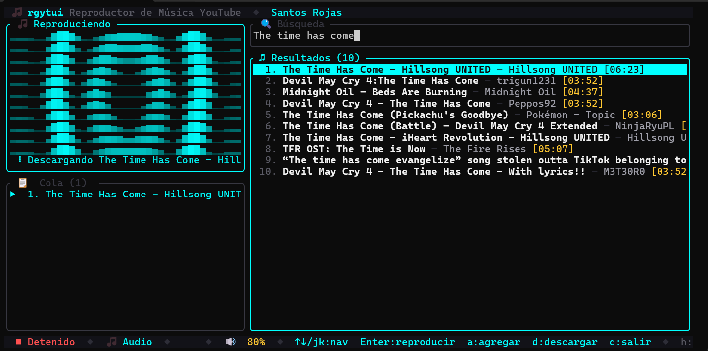
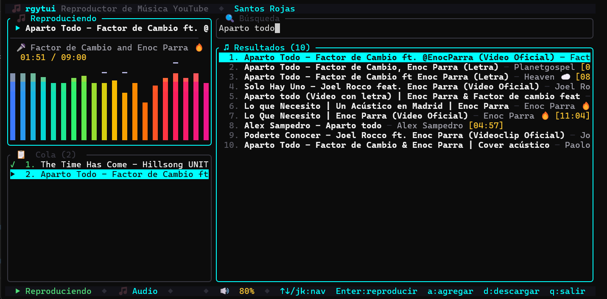

# rgytui 🎵

> **R**ust **G**orgeous **Y**ou**T**ube **UI** — a modern TUI application to search, stream, and play YouTube music from your terminal.

<p align="center">
  
  <br/>
  <em>Searching and loading music from YouTube</em>
</p>

<p align="center">
  
  <br/>
  <em>Playback with queue, volume control, and visualizer</em>
</p>

<p align="center">
  
  
  
  
</p>

---

## Features ✨

- **🔍 Search YouTube** — Find songs directly from the terminal
- **▶ Audio Playback** — Stream audio via `yt-dlp` + `rodio`
- **🎬 Video Mode** — Spawn `mpv` for video playback
- **📋 Queue Management** — Build and persist playlists
- **🎚 Volume Control** — Real-time volume adjustment
- **⏩ Auto-next** — Automatically advances the queue
- **💾 Persistent State** — Remembers volume, queue across sessions
- **⌨️ Keyboard-driven** — Full TUI with vi-style navigation
- **🐧 Cross-platform** — Windows, Linux, macOS

---

## Installation 📦

One command. The installer downloads a pre-built binary — no Rust toolchain or compilation required. Only runtime dependencies (`yt-dlp`, `mpv`) are installed automatically.

### Linux / macOS

```bash
curl -fsSL https://raw.githubusercontent.com/SantosRojas/rgytui/master/scripts/install.sh | bash
```

The installer will:
1. Detect your OS and architecture
2. Download the matching pre-built binary from the latest GitHub Release
3. Install it to `~/.local/bin/rgytui`
4. Install runtime dependencies (`yt-dlp`, `mpv`) via your package manager

> Make sure `~/.local/bin` is in your `PATH`.

#### Options

```bash
# Nightly build (latest commit on main)
curl -fsSL ... | bash -s -- --nightly

# Build from source instead
curl -fsSL ... | bash -s -- --build-from-source

# Force overwrite existing installation
curl -fsSL ... | bash -s -- --force
```

### Windows

Open PowerShell and run:

```powershell
iwr -Uri https://raw.githubusercontent.com/SantosRojas/rgytui/master/scripts/install.cmd -OutFile install.cmd -UseBasicParsing; .\install.cmd
```

The installer will:
1. Download the pre-built binary from the latest GitHub Release
2. Install it to `%LOCALAPPDATA%\rgytui\bin\rgytui.exe`
3. Add it to your user `PATH`
4. Install runtime dependencies (`yt-dlp`, `mpv`) via winget or direct download

> You may need to restart your terminal for PATH changes to take effect.

#### Options

```powershell
.\install.ps1 -Nightly          # Nightly build
.\install.ps1 -BuildFromSource   # Build from source
.\install.ps1 -Force             # Overwrite without prompting
```

### Updating

```bash
rgytui update
```

Pulls the latest source, rebuilds, and replaces the installed binary. The update command requires git and cargo — it clones and compiles from source like the original installer.

To switch to a new release binary instead, re-run the installer:

```bash
curl -fsSL https://raw.githubusercontent.com/SantosRojas/rgytui/master/scripts/install.sh | bash -s -- --force
```

---

## Quick Start 🚀

```bash
# Start the TUI
rgytui

# Inside the app:
/                  # Focus search
Type query + Enter # Search YouTube
↓ ↑               # Navigate results
Enter             # Play selected song
Space             # Play / Pause
q                 # Quit
?                 # Help
```

---

## Key Bindings ⌨️

| Key | Action |
|---|---|
| `/` | Focus search input |
| `Enter` | Search / Play selected |
| `↑` / `↓` | Navigate list |
| `Tab` | Switch focus (search ↔ results) |
| `Space` | Play / Pause |
| `s` | Stop playback |
| `n` | Next track |
| `p` | Previous track |
| `+` / `=` | Volume up |
| `-` | Volume down |
| `a` | Add selected to queue |
| `v` | Toggle audio / video mode |
| `?` | Toggle help screen |
| `Esc` | Back / Unfocus |
| `q` | Quit |

---

## Dependencies 📋

| Dependency | Required | Purpose |
|---|---|---|
| [yt-dlp](https://github.com/yt-dlp/yt-dlp) | ✅ Yes | Extract stream URLs and metadata from YouTube |
| [mpv](https://mpv.io) | ❌ No (video mode) | External video playback |

All Rust dependencies are managed by Cargo:
`ratatui` · `crossterm` · `tokio` · `rodio` · `serde_json` · `rustfft` · `rfd`

---

## Build from Source 🔧

```bash
git clone https://github.com/SantosRojas/rgytui.git
cd rgytui

# Debug build
cargo build

# Release build
cargo build --release

# Run
./target/release/rgytui
```

---

## Architecture 🏗

```
┌─────────────────────────────────────────────────────┐
│                   TUI (ratatui)                      │
│         Search · Player · Help · Components          │
└──────────────────────┬──────────────────────────────┘
                       │ Events (tokio mpsc)
┌──────────────────────▼──────────────────────────────┐
│              Use Cases (Application)                 │
│       SearchUseCase · PlaybackUseCase · PlaylistUC   │
└──────┬──────────────────────────────┬───────────────┘
       │                              │
┌──────▼──────────────┐   ┌──────────▼────────────┐
│    Domain Model     │   │   Infrastructure       │
│  Song · Playlist   │   │  YtDlpClient           │
│  PlayerState (FSM) │   │  RodioBackend          │
│  DomainError       │   │  MpvBackend            │
└────────────────────┘   │  ConfigStore           │
                         └───────────────────────┘
```

### Audio Pipeline

```
yt-dlp --dump-json ──► Song metadata
yt-dlp -f bestaudio -g URL ──► Stream URL
reqwest GET ──► tempfile ──► rodio::Decoder ──► rodio::Player ──► Audio
```

The application follows [Hexagonal Architecture](https://alistair.cockburn.us/hexagonal-architecture/) (Ports & Adapters):

- **Domain** — Pure business logic, zero external dependencies
- **Application** — Use cases that orchestrate domain logic
- **Infrastructure** — Adapters for external systems (yt-dlp, audio, HTTP, filesystem)
- **Interface** — TUI presentation layer powered by `ratatui`

---

## Configuration ⚙️

Settings are persisted to `%APPDATA%\rgytui\settings.json` (Windows) or `~/.config/rgytui/settings.json` (Linux/macOS):

```json
{
  "volume": 0.8,
  "audio_mode": true,
  "default_search_limit": 10
}
```

Playlists are saved to `playlist.json` in the same directory.

---

## Contributing 🤝

Contributions are welcome! Please:

1. Fork the repository
2. Create a feature branch (`git checkout -b feature/amazing`)
3. Commit your changes (`git commit -m 'Add amazing feature'`)
4. Push to the branch (`git push origin feature/amazing`)
5. Open a Pull Request

### Development

```bash
cargo check      # Verify compilation
cargo test       # Run tests
cargo clippy     # Lint
cargo fmt        # Format code
```

---

## License 📄

MIT — see [LICENSE](LICENSE)

---

<p align="center">
  Made with ❤️ and Rust
</p>